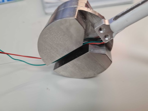
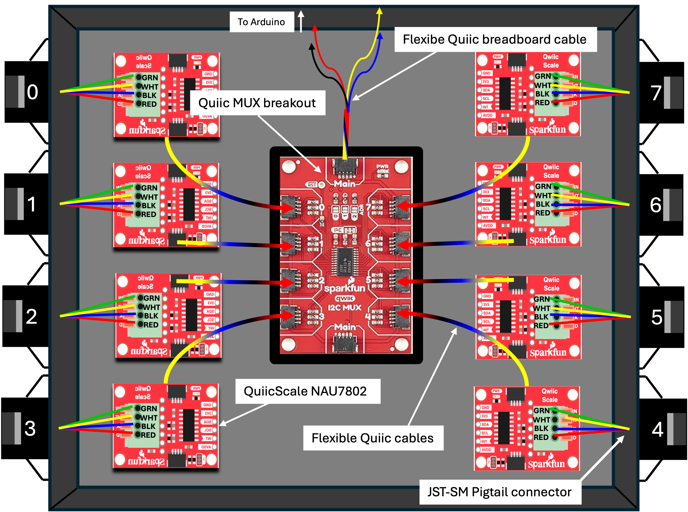
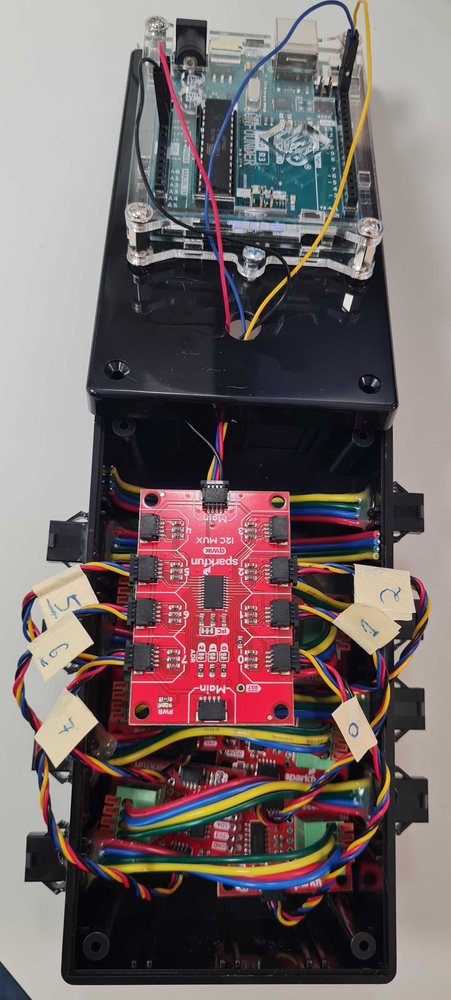
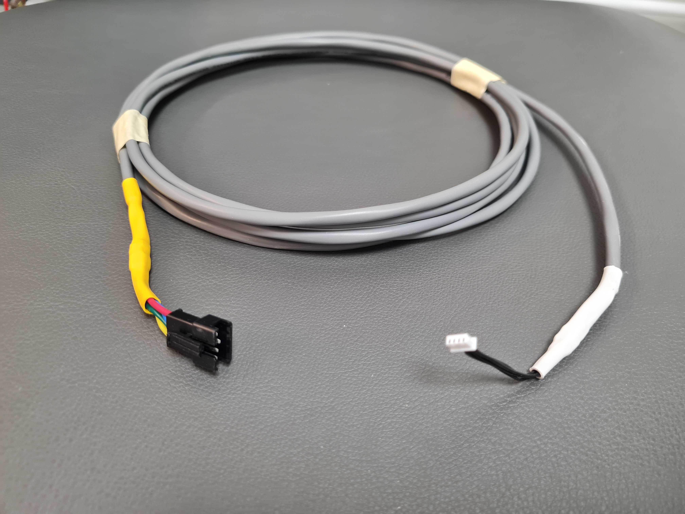

# 1. Self-built weighing device (scale)
The self-build scale consists of the following items:
* Mini load cell 500g
* 3D printed perch, customized to be screwed onto the load cell
* Cylindrical steel weight, also customized to screw the load cell onto it
* 4-pin connector, to easily connect and disconnect the scale to/from the control system.

see [parts list](https://github.com/NeuralSyntaxLab/perch-scale-system/tree/main/docs/parts) for further information and specifics.

To asemble the scale:
1. Solder the wires of the load cell to a 4-pin connector
2. Screw the load cell to the 3D printed perch on one side and to the steel weight on the other side, making sure that:
   * The side with the wires is screwed to the weight, enabling the wires to go in the gap under the weight.
   * The load cell's arrow indicating its direction is pointing down.
  
<figure>
  
</figure>

<figure>
  
  <figcaption>
    <strong>Figure 1.</strong> Underview of the perch-scale (top) with an illustration of the perch (bottom).
  </figcaption>
</figure>

# 2. Control box
When weighing several birds in one setup, it is highly recommended to use a central control system, so that the microcontroller and minicomputer are located in a central, organized location, and the scales are connected through a control box located next to them. This control box contains the breakout boards (MUX, NAU7802) with customized connectors to easily modify the connections with the scales scattered around the room inside the birdcages. 

**Part list:**
1. Plastic box
2. SparkFun Qwiic MUX breakout
3. SparkFun QwiicScale NAU7802 (multiple)
4. JST-SM Pigtail connector (4-PIN) (multiple)
5. Flexible Qwiic cables (multiple)
6. Flexible Qwiic breadboard cable

**Wiring the components in the control box:**
Follow this diagram to connect each of the components mentioned above.

<figure>
  
  <figcaption>
    <strong>Figure 2.</strong> Image of the scale system control box form inside.
  </figcaption>
</figure>

It should look like this:  

<figure>
  
  <figcaption>
    <strong>Figure 2.</strong> Image of the scale system control box form inside.
  </figcaption>
</figure>

# 3. Communication cables
In order to easily manage connecting the scales to the control system, it is best to make custom communication cables with the neccesary length to connect between the location of the bird cage and the control box using simple 4-core network/telephone cables. These cables connect to the scale on one side (directly, or using the same connector used for the load cell), and to the NAU7802 breakout board on the other side. These cables allow easy setup and removal of the scale in and out of the birdcage, inside the acoustic box.

<figure>
  
  <figcaption>
    <strong>Figure 2.</strong> Image of the comunication cable. Note the connectors at both ends, where the smaller one goes to the parch-scale device and the larger one goes to the control box.
  </figcaption>
</figure>
