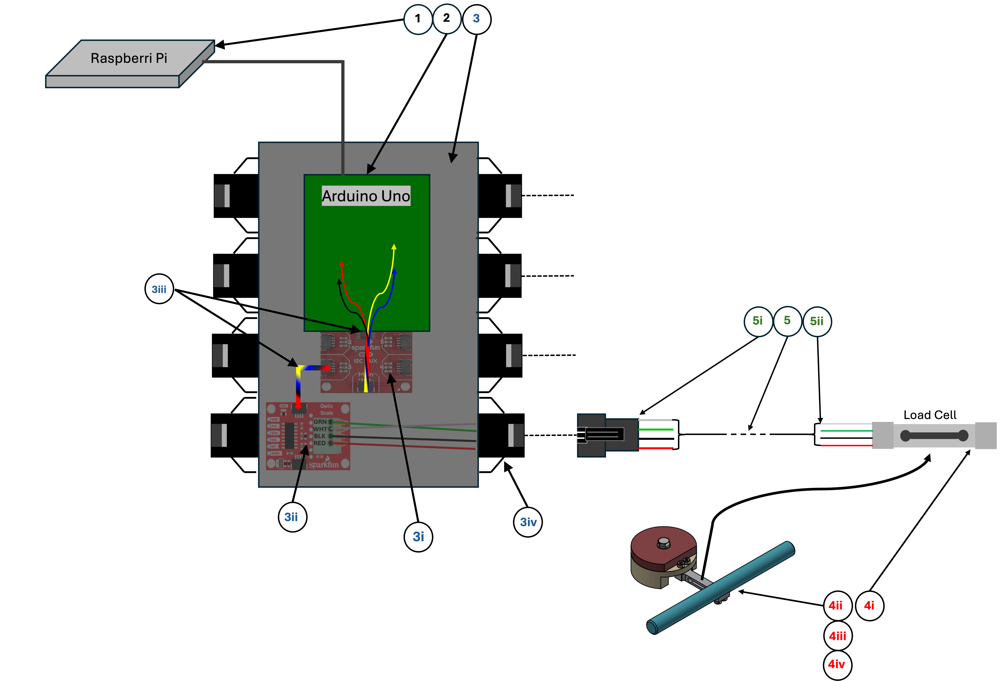
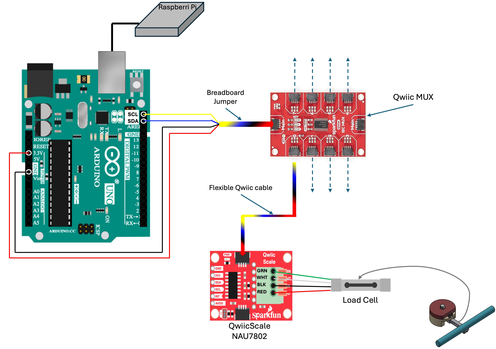
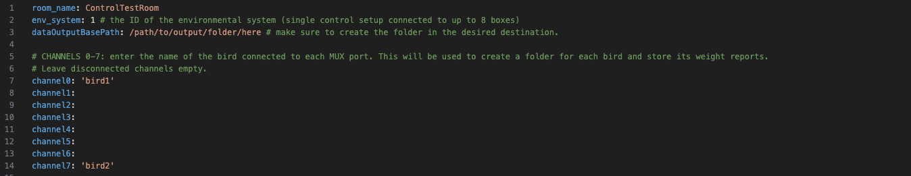
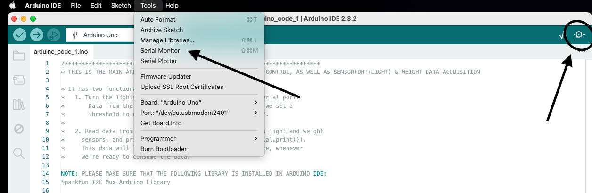

# Scale System setup guide
## 1. Overview
The Scale System is a setup designed to monitor the weight of multipe, freely-behaving birds directly while in their cage (possibly while recording the birds' songs, monitoring their movement or recording neural data directly from their brain), in order to detect weight loss as a marker for their health condition.

The weighing is conducted by placing a load-cell-based weighing device (scale) in the bird's cage. This device is connected to an ADC breakout board (NAU7802) which helps convert and amplify the signal from the load cell to an I2C signal, readable with a microcontroller from which we can extract the weight in grams. The data collection is controlled by a script that runs continuously on the minicomputer, receives weighing data from the microcontroller, and stores it in '.csv' files.

Each Scale System is capable of connecting up to 8 weighing devices per microcontroller with the help of another breakout board (MUX), which enables communication with multiple I2C devices simultaneously.

---

## 2. Part list
The Scale System consists of the following items:
  1. Raspberry Pi (or similar) minicomputer
  2. Arduino UNO microcontroller
  3. Control box
      1. Sparkfun Qwiic MUX breakout board
      2. Sparkfun Qwiic Scale NAU7802 breakout board (multiple)
      3. Flexible Qwiic cables 
      4. Docking points (4-PIN JSM-ST Pigtail connector - male, multiple)
  4. Self-built weighing devices (multiple)
     1. Mini load cell 500g
     2. 3D printed perch, customized to be screwed onto the load cell
     3. Cylindrical steel weight, also customized to screw the load cell onto it
     4. 4-pin connector, to easily connect and disconnect the scale to/from the control system.
  5. Communication cables
     1. 4-PIN JSM-ST Pigtail connector (female)
     2. Circuit Picoblade Male-to-Female plug 425mm

see [general part list](https://github.com/NeuralSyntaxLab/perch-scale-system/tree/main/docs/parts) for full list of parts and where to get them.

### Scale System setup schematic overview

<figure>
  
  <figcaption>
    <strong>Figure 1.</strong> Schematic overview of the scale system and its components.
  </figcaption>
</figure>

### Assembly
See [Scale System assembly guide](https://github.com/NeuralSyntaxLab/perch-scale-system/blob/main/docs/manuals/Scale%20System%20Assembly%20Guide.md) for assembly instructions for each part.

---

## 3. Wiring the Scale System 

Before operating the Scale System setup, follow these instructions to connect all the pieces together:
1. Open the control box, and connect as many docking points (NAU7802 board + Pigtail connector male) to the MUX as you plan to use (When adding/removig scales at any point, it will be neccesary to stop the main script, open the box and re-wire the docking points. NAU7802 boards that are connected to the MUX but not to a scale can cause issues with the code). Write down under each docking point to which channel on the MUX board it is connected to.
2. Place scales in the corner of the cages of the birds you wish to weigh with their connector sticking out.
3. Connect the communication cable to the scale inside the acoustic box and spread the cable through the hole in the side of the acoustic box all the way to the control center (Repeat for all scales you wish to connect)
4. Connect the communication cable's other side to a docking point on the control box. IMPORTANT! make sure that you know which bird is connected to which channel on the control box (and MUX accordingly)
5. Connect the Qwiic MUX to the Arduino microcontroller through the hole in the control box lid, using a Flexible Qwiic breadboard cable (connector on one side and 4 separate pins on the other):
  * Black pin (ground) - to any 'gnd'
  * Red pin (voltage) - to 3.3V channel
  * Yellow pin (signal) - to 'SCL' channel
  * Blue pin (signal) - to 'SDA' channel

<figure>
  
  <figcaption>
    <strong>Figure 2.</strong> Scale system wiring scheme.
  </figcaption>
</figure>

6. Connect the Arduino microcontroller to the minicomputer.
7. Connect the minicomputer to the power source, screen, keyboard and mouse. Continue to the next step to operate the system on the minicomputer.

---

## 4. Operating the system
Once the system is up and connected, wait for the minicomputer (or any platform you are using) to start up and follow the instructions:

### 4.1.1 Overview

The Python code included in this repository provides a **complete data-acquisition pipeline** for the perch-scale system. It continuously communicates with the Arduino, receives up to eight weight measurements each second, organizes them according to the **channel → bird ID** mapping in the config file, and saves **per-bird CSV reports** to the designated output directory.

This repository provides:

- The **acquisition script** (`scale_main_code.py`) that manages serial communication, parsing, organization, and long-term logging of weights.  
- A **YAML config file** (`config_1.yaml`) that defines:  
  - Which bird is connected to each MUX/Arduino **channel**  
  - The **save directory** for all weight reports  
  - A short **system/room identifier** used in directory naming  
- An optional **startup_script.sh** (to be added) for running the acquisition automatically at boot on Linux systems.

**What this repository does *not* cover:**  
General operating-system setup (installing Raspberry Pi OS, configuring USB serial permissions, networking, etc.). Any functioning Linux/macOS/Windows environment that can run Python and access the Arduino serial port is compatible.

### 4.1.2 How the code works 

1. The config file is loaded and its parameters are stored as variables for use in the script.
2. The script detects and opens the Arduino’s serial port automatically.  
3. Every second, the Arduino sends a packet of **eight weight values**, one per channel.  
4. The script:  
   - Matches each channel to its configured **bird ID**,  
   - Appends a timestamp,  
   - Accumulates one minute of readings,  
   - Saves them as **per-bird CSV files** inside:  
     ```
     <scaleOutputBasePath>/weight_reports/<bird_id>/<bird_id>_weight_report.csv
     ```

This loop runs indefinitely, enabling continuous 24/7 monitoring.

### 4.1.3 Requirements and first-time setup

To run the system on any computer:

#### 1. **Install Python 3.7+**  
   Works on Raspberry Pi OS, Ubuntu/Linux, macOS, or Windows.

#### 2. **Clone the repository**
   ```bash
   git clone <repo-url>
   cd <repo-folder>
```

#### 3. Create a Python environment (recommended)
```bash
python3 -m venv .venv
source .venv/bin/activate   # Linux/macOS
# .venv\Scripts\activate    # Windows
```

#### 4. Install dependencies
```bash
pip install -r requirements.txt
```

#### 5. Prepare your config file (`config_1.yaml`)
- Assign a **bird ID** for each active channel (0–7), or use `null` for unused channels.  
- Set the **scaleOutputBasePath** (the folder where weight files will be stored).  
- Optionally set the **room/system name**.

For further instructions see section [4.3 Editing the Config file](#43-editing-the-config-file).

#### 6. Connect the Arduino
The script automatically tries common serial port names on Linux, macOS, and Windows.

---

### **4.2.1 Running the script manually**

After updating your config file, run the acquisition program with:

```bash
python /path/to/scale_main_code.py --config=/path/to/config_1.yaml
```
Remember to modify the bash script permission.
in the terminal type : 
```bash
chmod +x path/to/script/startup_script.sh
```

You should see confirmation of the detected serial port and the loaded configuration.

### **4.2.2 Running automatically on startup (Linux)**

To automatically run the script when the machine turns on:

1. Modify the bash script permission. in Terminal type : `chmod +x path/to/script/startup_script.sh`. 
2. In terminal Type `sudo nano /etc/xdg/lxsession/LXDE-pi/autostart`
3. Add the following command to the end of the file - 
`@lxterminal -e /path/to/script/startup_script.sh`
  save and exit terminal.

## 4.3 Editing the config file

After downloading this repository to your computer, you will find the `config_1.yaml` file in the `Python code` folder. Open the config file [example here](https://github.com/NeuralSyntaxLab/perch-scale-system/blob/main/src/main/config_1.yaml).

Here, you will need to enter the names of the birds that have weighing devices in their cage in the `Channels` section.
Each docking port (channel) is connected to one scale. Write the name of the bird that is connected to each channel, with apostrophes.
You also need to make sure to create a directory for the output data to be stored. Enter the full path to that directory in `scaleOutputBasePath`. 

For example - 'bird1' is in the acoustic chamber with the scale connected to channel 0. 'bird2' is in the acoustic chamber that is connected to channel 7. 

<figure>
  
  <figcaption>
    <strong>Figure 3.</strong> Example of the configuration file.
  </figcaption>
</figure>

### 4.4 Calibrating the scales

#### 4.4.1 Calibrate the scales on the Arduino serial monitor platform
1. If running, stop the main control script (`scale_main_code.py`).
2. Load Arduino with [arduino_code_calibrate](https://github.com/NeuralSyntaxLab/perch-scale-system/blob/main/src/arduino/arduino_code_calibrate/arduino_code_calibrate.ino).
3. Open the Serial Monitor: <br>
On the Arduino IDE, click `Tools` -> `Serial Monitor` or click on the top right Serial Monitor logo.

<figure>
  
  <figcaption>
    <strong>Figure 4.</strong> Accessing the serial monitor on the Arduino IDE platform.
  </figcaption>
</figure>

When the serial monitor opens, it should immediately start communicating with the MUX system and notify the user with the satatus of every connected scale and instructions on how to calibrate. Be prepared with a calibrating item with known exact weight (preferably within a range of a few grams).

* In general, output on the serial monitor will show detected scales and their calibration values (zero-offset and calibration factor) in the setup phase.
* A scale is detected on channel X if a docking port (NAU7802 board) is connected to that channel on the MUX board.
* After the setup phase, a new line of data from all 8 channels is given every second in the format `c0: 0.00` for channel 0, `ch1: 2.14` for channel 2 and so on.
* Some disconnected channels give numbers that are not 0 or none because the Arduino already has information about previous scales that were connected to those channels stored in its memory. Just ignore them and only look for the relevant channels.
* At Initial setup of a new Arduino, scales should not have calibration values, and you will have to follow the on-screen instructions in the serial monitor and calibrate each connected scale.
* For every change - relocation, addition ,cleaning of a scale etc. - **re-calibration of the scale is neccesary.**

4. Wait for the setup phase to complete, click on the Message panel to pass input to the Arduino, write `c` and press enter. Calibration process will now begin and indicative prompts will appear.
  * At initial setup, the Arduino will not detect calibration values for any scale and calibration proces will start automatically!

5. Follow instructions on screen to complete the calibration process for the desired scales.

#### Example 1: Calibrating in and already-used setup, but with new scale wiring
<figure>
  
  <figcaption>
    <strong>Figure 5.</strong> Example of the calibration process on the Arduino IDE.
  </figcaption>
</figure><br>
<br>
In this example, the first lines show that docking ports 0 and 6 are "active" (meaning that they are connected to the MUX board). Other ports / channels are not detected because they are not connected to the MUX board. The output will include the zero offset and calibration factor that are saved on the Arduino memory for these ports. 
After the setup phase in which the Arduino passed information about channels 0 and 6, it moves on to the next phase. 
Now every second a new line of data is given. We can see that it is a used setup because weighing data is given for disconnected scales. We will focus on data given from channels 0 and 6.

#### Calibration process for scale 0 looks like this:

<figure>
  
  <figcaption>
    <strong>Figure 5.</strong> Example of the calibration process on the Arduino IDE, continued.
  </figcaption>
</figure><br>
<br>
1. After entering `c` in the message panel, the calibration began and the first prompt was given.
2. User input was 0 - to calibrate scale on port 0.
3. Next prompt instructed to clear the scale from any weight and press any key to continue - in this case the user input was `k` (could be any key).
4. Next prompt indicated the new zero offset saved to the Arduino memory.
5. Next prompt instructed to put known weight on the scale and press any key. In this case user put a known weight of 2.14 grams on the scale, wrote `k` in the message panel and pressed enter.
6. Next prompt instructed to enter the known weight in grams in the message pael and press enter. no apostrophe needed! User entered `2.14`
7. Next prompt indicated the new calibration factor saved to the Arduino memory, followed by new scale reading after calibration.
8. Calibration is complete and the Serial monitor keeps showing new lines of data.
9. In order to calibrate the scale on port 6, enter `c` in the message panel again and choose port 6.


#### 4.4.2. Re-adjust the config file accordingly
Change any bird - channel indexing according to the instructions in section [Editing the config file](#43-editing-the-config-file).

#### 4.4.3. Re-run the main control script
After calibrating the scales and updating the config file, the system is ready to go.
In order to run the main control script, simply reboot the minicomputer. The script should run automatically at startup.

* It is recommended to test the system to see that it works properly before leaving it to run. You can run the script by ...
* You can also open the terminal and run the following command (Change paths accordingly):
```
python /path/to/script/main_control.py --config=/path/to/config/file
```


